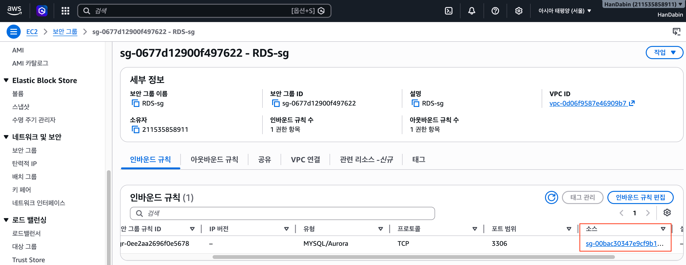
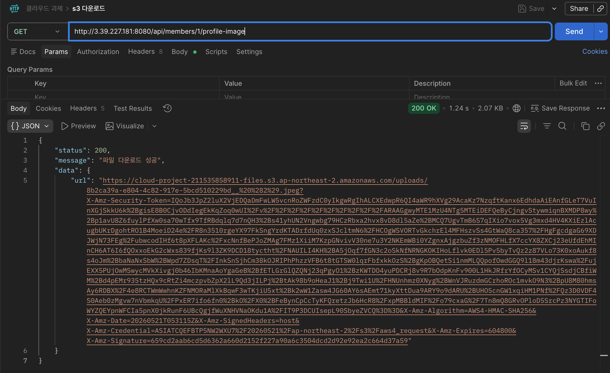
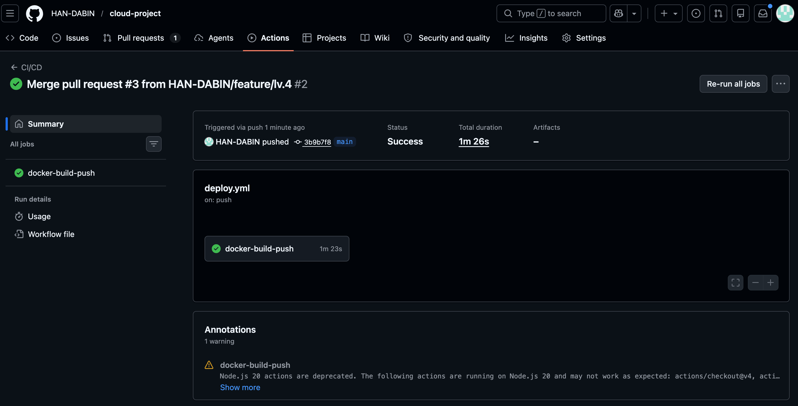
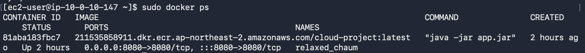

## Lv.0
AWS Budgets 화면

***
## Lv.1

EC2 퍼블릭 IP: 3.39.227.181

***

## Lv.2

### 1. Actuator Info 엔드포인트 URL

http://3.39.227.181:8080/actuator/info

### 2. RDS 보안 그룹 스크린샷

***

## Lv. 3

### 1. 접근 성공 스크린샷 (IAM ROLE)

### 2. URL 만료 시간

## Lv .4

### 1. Github Actions 성공 이미지

### 2. EC2 터미널 이미지
